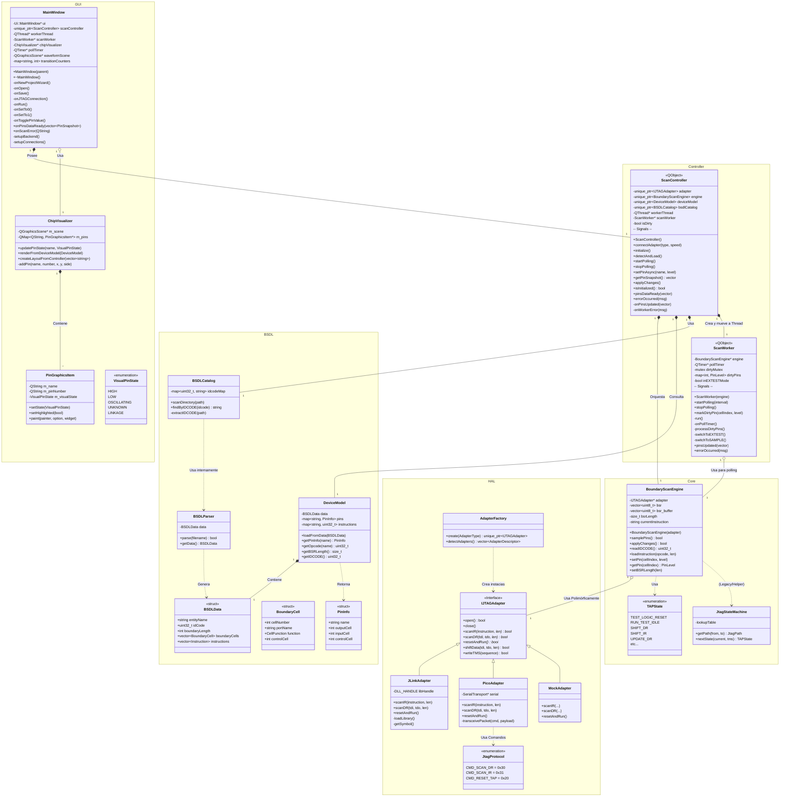

Instrucciones para compilar y ejecutar el proyecto en entorno Windows utilizando **Qt 6.7.3** y **MSVC 2022**.

## Requisitos Previos

* **CMake** (instalado y añadido al PATH).
* **Visual Studio 2022** (con las herramientas de C++).
* **Qt 6.7.3** para MSVC 2022 64-bit.

> **Nota sobre la ruta de Qt:**
> Los comandos a continuación asumen que Qt está instalado en la ruta por defecto: `C:\Qt\6.7.3\msvc2022_64`.
> Si tu instalación se encuentra en otra carpeta, por favor modifica la ruta en el comando de configuración.
## Pasos para Compilar (Modo Debug)

Abre una terminal (PowerShell o CMD) en la carpeta raíz del proyecto y ejecuta los siguientes comandos en orden:

### 1. Configurar el proyecto
Este comando genera la carpeta `build` y configura el proyecto vinculando las librerías de Qt. Dentro de ella estará la carpeta `Debug` en la que se encontrará el ejecutable con las librerias necesarias

```powershell
cmake -DCMAKE_PREFIX_PATH="C:\Qt\6.7.3\msvc2022_64" -S . -B build
cmake --build build --config Debug
C:\Qt\6.7.3\msvc2022_64\bin\windeployqt.exe build\Debug\JtagScannerQt.exe
```

