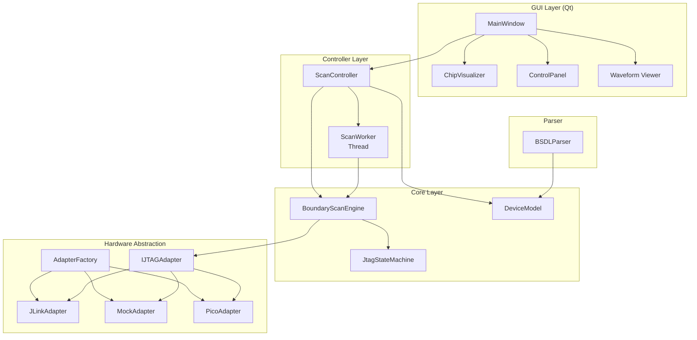
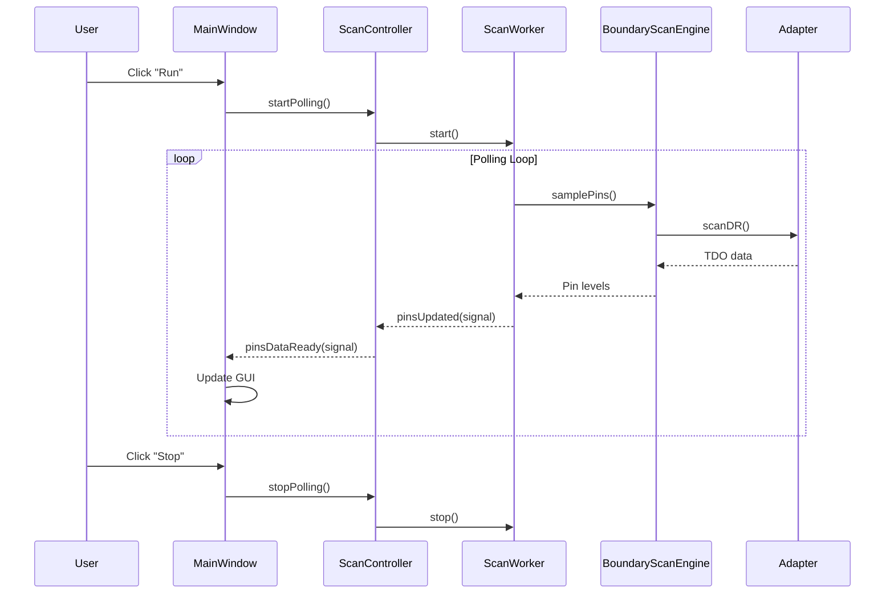
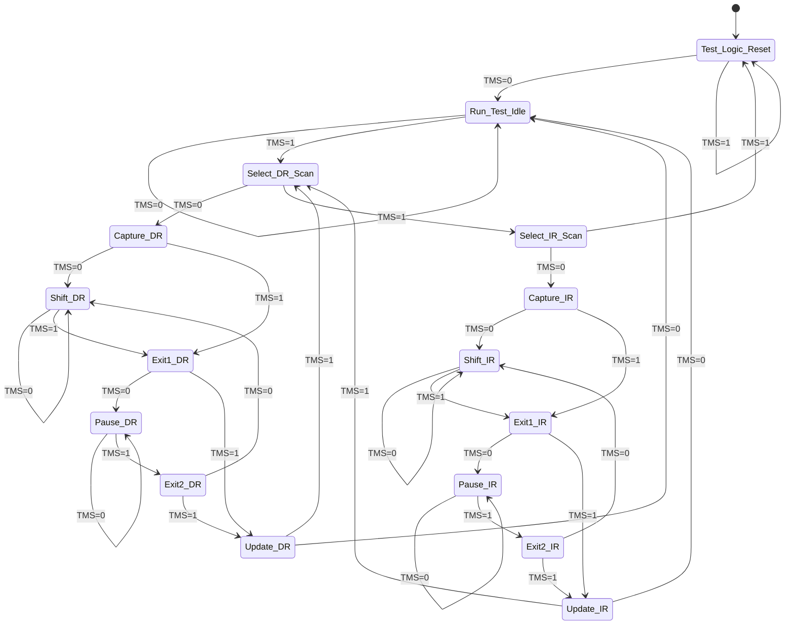

# JtagScannerQt

**Herramienta de Boundary Scan JTAG con interfaz gráfica Qt**

Una aplicación de escritorio para Windows que permite interactuar con dispositivos JTAG mediante el estándar IEEE 1149.1 (Boundary Scan). Diseñada para depuración, testing y análisis de señales en tiempo real.


---

## Tabla de Contenidos

- [Características](#características)
- [Requisitos](#requisitos)
- [Instalación](#instalación)
  - [Para Usuarios](#para-usuarios)
  - [Para Desarrolladores](#para-desarrolladores)
- [Uso Rápido](#uso-rápido)
- [Arquitectura](#arquitectura)
- [Estructura del Proyecto](#estructura-del-proyecto)
- [Funcionalidades](#funcionalidades)
- [Configuración](#configuración)
- [Adaptadores Soportados](#adaptadores-soportados)
- [Contribuir](#contribuir)

---

## Características

- **Visualización gráfica del chip** con pines codificados por color según su estado
- **Waveform viewer** para análisis de señales en tiempo real
- **Modos JTAG completos**: SAMPLE, EXTEST, INTEST, BYPASS
- **Soporte multi-adaptador**: J-Link, Mock (simulador), Pico (en desarrollo)
- **Parser BSDL** para cargar descripciones de dispositivos
- **Control de pines** individual o por buses
- **Gestión de proyectos** con persistencia en JSON
- **Logging condicional** (Debug/Release)
- **Optimizado** para polling de alta frecuencia (hasta 1000 samples/s)

---

## Requisitos

### Para Usuarios
- Windows 10/11 (64-bit)
- Adaptador JTAG compatible (o usar simulador Mock)

### Para Desarrolladores
- **CMake** 3.16+
- **Qt** 6.x (Widgets, Core, Gui, SerialPort)
- **Compilador**: MSVC 2019/2022 (Visual Studio)
- **C++17** o superior

---

## Instalación

### Para Usuarios

1. Descarga la última release desde la sección [Releases](../../releases)
2. Extrae el archivo ZIP en una carpeta
3. Ejecuta `JtagScannerQt.exe`

### Para Desarrolladores

#### 1. Clonar el repositorio

```bash
git clone https://github.com/tu-usuario/JtagScannerQt.git
cd JtagScannerQt
```

#### 2. Configurar Qt

Asegúrate de tener Qt 6.x instalado y configurado en tu PATH, o usa Qt Creator.

#### 3. Compilar con CMake

```bash
mkdir build
cd build
cmake ..
cmake --build . --config Release
```

#### 4. Compilar desde Qt Creator

1. Abre `CMakeLists.txt` con Qt Creator
2. Selecciona el kit de compilación (MSVC 2019/2022)
3. Click en "Build" (Ctrl+B)

> **Nota**: El proyecto incluye auto-deployment de DLLs con `windeployqt` para Windows.

---

## Uso Rápido

### 1. Crear un nuevo proyecto

1. **File → New Project Wizard**
2. Selecciona el tipo de adaptador
3. Configura el tipo de encapsulado (EDGE/BGA)
4. Carga el archivo BSDL de tu dispositivo

### 2. Conectar al dispositivo

1. **Scan → JTAG Connection** para conectar el adaptador
2. **Scan → Examine Chain** para detectar dispositivos
3. El IDCODE aparecerá automáticamente

### 3. Modos de operación

| Modo | Descripción |
|------|-------------|
| **SAMPLE** | Lee el estado actual de los pines (solo lectura) |
| **EXTEST** | Control externo de pines (lectura/escritura) |
| **INTEST** | Testing interno del chip |
| **BYPASS** | Modo bypass para cadenas multi-dispositivo |

### 4. Analizar señales

1. **Waveform → Add Signal** para añadir pines al visor
2. Usa los cursores (C1, C2) para medir tiempos
3. Zoom con la rueda del ratón o botones de la toolbar

---

## Arquitectura

### Diagrama de Componentes


```mermaid
graph TB
    subgraph GUI["GUI Layer (Qt)"]
        MW[MainWindow]
        CV[ChipVisualizer]
        CP[ControlPanel]
        WF[Waveform Viewer]
    end

    subgraph Controller["Controller Layer"]
        SC[ScanController]
        SW[ScanWorker<br/>Thread]
    end

    subgraph Core["Core Layer"]
        BSE[BoundaryScanEngine]
        JSM[JtagStateMachine]
        DM[DeviceModel]
    end

    subgraph HAL["Hardware Abstraction"]
        AF[AdapterFactory]
        IJA[IJTAGAdapter]
        JL[JLinkAdapter]
        MA[MockAdapter]
        PA[PicoAdapter]
    end

    subgraph Parser["Parser"]
        BP[BSDLParser]
    end

    MW --> SC
    MW --> CV
    MW --> CP
    MW --> WF

    SC --> SW
    SC --> BSE
    SC --> DM

    SW --> BSE

    BSE --> JSM
    BSE --> IJA

    AF --> JL
    AF --> MA
    AF --> PA

    IJA --> JL
    IJA --> MA
    IJA --> PA

    BP --> DM
```

### Flujo de Datos


```mermaid
sequenceDiagram
    participant User
    participant MainWindow
    participant ScanController
    participant ScanWorker
    participant BoundaryScanEngine
    participant Adapter

    User->>MainWindow: Click "Run"
    MainWindow->>ScanController: startPolling()
    ScanController->>ScanWorker: start()

    loop Polling Loop
        ScanWorker->>BoundaryScanEngine: samplePins()
        BoundaryScanEngine->>Adapter: scanDR()
        Adapter-->>BoundaryScanEngine: TDO data
        BoundaryScanEngine-->>ScanWorker: Pin levels
        ScanWorker-->>ScanController: pinsUpdated(signal)
        ScanController-->>MainWindow: pinsDataReady(signal)
        MainWindow->>MainWindow: Update GUI
    end

    User->>MainWindow: Click "Stop"
    MainWindow->>ScanController: stopPolling()
    ScanController->>ScanWorker: stop()
```

### Máquina de Estados TAP


```mermaid
stateDiagram-v2
    [*] --> Test_Logic_Reset
    Test_Logic_Reset --> Run_Test_Idle: TMS=0
    Test_Logic_Reset --> Test_Logic_Reset: TMS=1

    Run_Test_Idle --> Run_Test_Idle: TMS=0
    Run_Test_Idle --> Select_DR_Scan: TMS=1

    Select_DR_Scan --> Capture_DR: TMS=0
    Select_DR_Scan --> Select_IR_Scan: TMS=1

    Capture_DR --> Shift_DR: TMS=0
    Capture_DR --> Exit1_DR: TMS=1

    Shift_DR --> Shift_DR: TMS=0
    Shift_DR --> Exit1_DR: TMS=1

    Exit1_DR --> Pause_DR: TMS=0
    Exit1_DR --> Update_DR: TMS=1

    Pause_DR --> Pause_DR: TMS=0
    Pause_DR --> Exit2_DR: TMS=1

    Exit2_DR --> Shift_DR: TMS=0
    Exit2_DR --> Update_DR: TMS=1

    Update_DR --> Run_Test_Idle: TMS=0
    Update_DR --> Select_DR_Scan: TMS=1

    Select_IR_Scan --> Capture_IR: TMS=0
    Select_IR_Scan --> Test_Logic_Reset: TMS=1

    Capture_IR --> Shift_IR: TMS=0
    Capture_IR --> Exit1_IR: TMS=1

    Shift_IR --> Shift_IR: TMS=0
    Shift_IR --> Exit1_IR: TMS=1

    Exit1_IR --> Pause_IR: TMS=0
    Exit1_IR --> Update_IR: TMS=1

    Pause_IR --> Pause_IR: TMS=0
    Pause_IR --> Exit2_IR: TMS=1

    Exit2_IR --> Shift_IR: TMS=0
    Exit2_IR --> Update_IR: TMS=1

    Update_IR --> Run_Test_Idle: TMS=0
    Update_IR --> Select_DR_Scan: TMS=1
```

---

## Estructura del Proyecto

```
JtagScannerQt/
├── CMakeLists.txt           # Configuración de build
├── README.md                # Este archivo
│
├── src/
│   ├── bsdl/                # Modelo de dispositivos
│   │   ├── DeviceModel.h/cpp
│   │   └── BSDLTypes.h
│   │
│   ├── controller/          # Controladores
│   │   ├── ScanController.h/cpp
│   │   └── ScanWorker.h/cpp
│   │
│   ├── core/                # Motor JTAG
│   │   ├── BoundaryScanEngine.h/cpp
│   │   └── JtagStateMachine.h/cpp
│   │
│   ├── gui/                 # Interfaz gráfica
│   │   ├── mainwindow.h/cpp/ui
│   │   ├── ChipVisualizer.h/cpp
│   │   ├── ControlPanelWidget.h/cpp
│   │   ├── ConnectionDialog.h/cpp
│   │   ├── NewProjectWizard.h/cpp
│   │   ├── ChainExamineDialog.h/cpp
│   │   └── SettingsDialog.h/cpp
│   │
│   ├── hal/                 # Abstracción de hardware
│   │   ├── IJTAGAdapter.h
│   │   ├── JtagProtocol.h/cpp
│   │   ├── drivers/
│   │   │   ├── MockAdapter.h/cpp
│   │   │   ├── JLinkAdapter.h/cpp
│   │   │   └── PicoAdapter.h/cpp
│   │   └── factory/
│   │       └── AdapterFactory.h/cpp
│   │
│   ├── parser/              # Parser BSDL
│   │   └── BSDLParser.h/cpp
│   │
│   └── utils/               # Utilidades
│       └── Log.h            # Sistema de logging
│
└── test_files/              # Archivos de prueba
    ├── *.bsd                # Archivos BSDL de ejemplo
    └── *.jsqp               # Proyectos de ejemplo
```

---

## Funcionalidades

### Visualización del Chip

| Color | Estado | Significado |
|-------|--------|-------------|
| 🔴 Rojo | HIGH | Nivel lógico 1 |
| 🔵 Azul | LOW | Nivel lógico 0 |
| 🟡 Amarillo | HIGH-Z | Alta impedancia |
| ⚫ Gris | UNKNOWN | No muestreado |
| ⬛ Negro | LINKAGE | No controlable |

### Waveform Viewer

- **Cursores**: C1, C2 con cálculo de delta time
- **Zoom**: 10ms/div hasta 10s/div
- **Navegación**: Scroll horizontal, ir a tiempo específico
- **Buffer circular**: Hasta 100,000 muestras
- **Min-Max decimation**: Preserva transiciones al hacer zoom out

### Gestión de Proyectos

Los proyectos se guardan en formato JSON (`.jsqp`) con:
- Ruta al archivo BSDL
- Configuración del adaptador
- Señales en el waveform
- Layout de ventanas
- Parámetros de rendimiento

---

## Configuración

### Settings Dialog (View → Settings)

| Parámetro | Rango | Default | Descripción |
|-----------|-------|---------|-------------|
| Samples/s | 1-1000 | 10 | Frecuencia de muestreo |
| Waveform FPS | 1-60 | 30 | Tasa de refresco del waveform |
| ChipVis FPS | 1-30 | 10 | Tasa de refresco del chip |

### Niveles de Logging

Definidos en `src/utils/Log.h`:

| Nivel | Valor | Activo en Debug | Activo en Release |
|-------|-------|-----------------|-------------------|
| ERROR | 1 | ✅ | ✅ |
| WARNING | 2 | ✅ | ✅ |
| INFO | 3 | ✅ | ✅ |
| DEBUG | 4 | ✅ | ❌ |
| VERBOSE | 5 | ✅ | ❌ |
| TRACE | 6 | ✅ | ❌ |

Para cambiar el nivel manualmente:
```cmake
add_compile_definitions(LOG_LEVEL=4)  # Solo hasta DEBUG
```

---

## Adaptadores Soportados

### Segger J-Link

- **Estado**: ✅ Completo
- **Requisitos**: DLL de J-Link instalada
- **Características**: Selección por número de serie, velocidad configurable

### Mock Adapter (Simulador)

- **Estado**: ✅ Completo
- **Uso**: Desarrollo y testing sin hardware
- **Características**: Simula dispositivo JTAG con datos dinámicos

### Raspberry Pi Pico

- **Estado**: 🚧 En desarrollo
- **Requisitos**: Firmware personalizado (pendiente)

### FT2232H

- **Estado**: 📋 Planificado

---

## Contribuir

### Reportar Bugs

1. Abre un [Issue](../../issues) describiendo el problema
2. Incluye pasos para reproducir
3. Adjunta logs si es posible (ejecuta en modo Debug)

### Añadir Funcionalidades

1. Fork del repositorio
2. Crea una rama: `git checkout -b feature/mi-funcionalidad`
3. Haz commits descriptivos
4. Abre un Pull Request

### Añadir Soporte para Nuevo Adaptador

1. Crea una clase que herede de `IJTAGAdapter`
2. Implementa las funciones virtuales puras
3. Registra el adaptador en `AdapterFactory`
4. Añade el tipo en `AdapterType` enum

Ejemplo mínimo:
```cpp
class MiAdapter : public IJTAGAdapter {
public:
    bool open() override;
    void close() override;
    bool shiftData(const std::vector<uint8_t>& tdi,
                   std::vector<uint8_t>& tdo,
                   size_t bitCount) override;
    // ... resto de funciones
};
```

---

## Licencia

Este proyecto es parte de un Trabajo de Fin de Grado (TFG) de la Universidad de Valladolid.

---

## Contacto

Para dudas técnicas o colaboraciones, abre un Issue en el repositorio.
